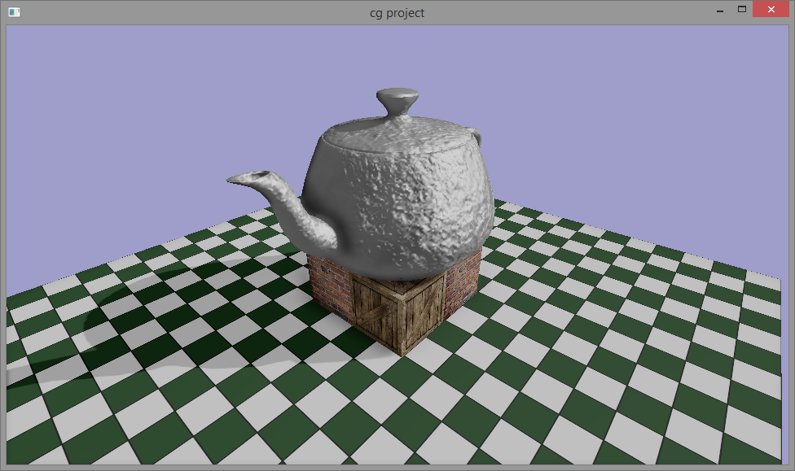
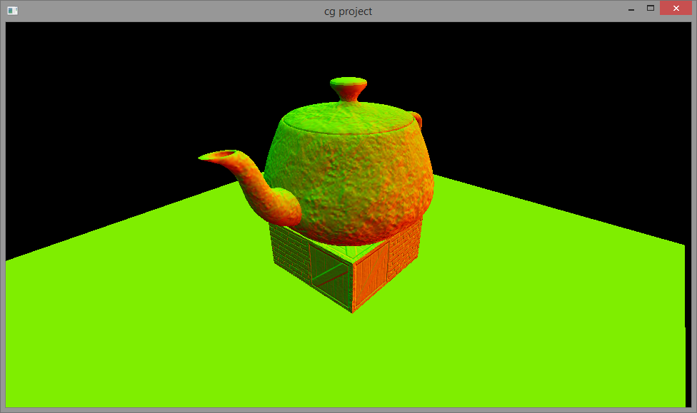
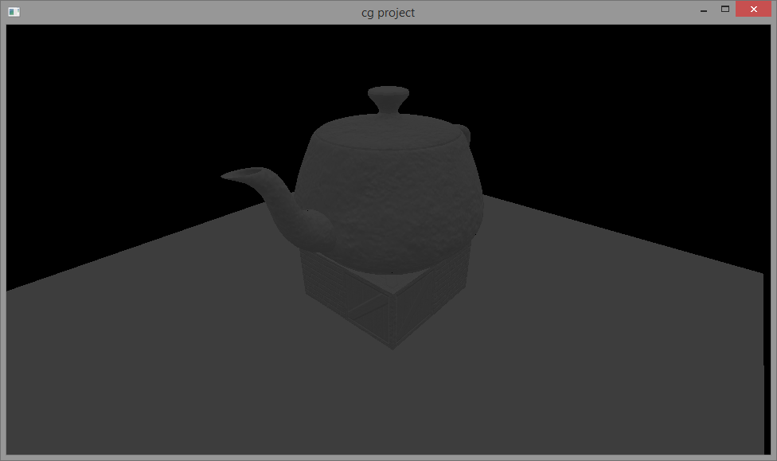
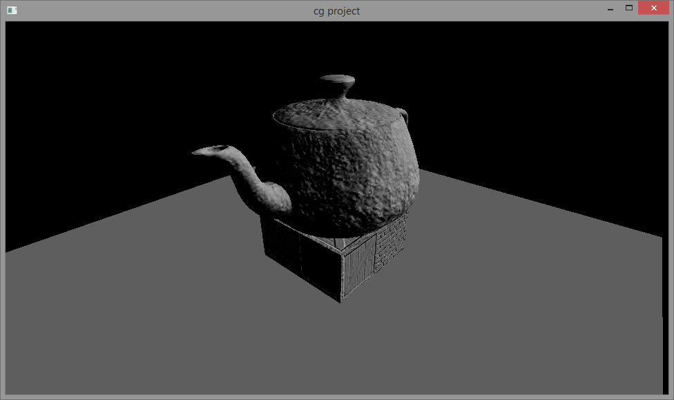
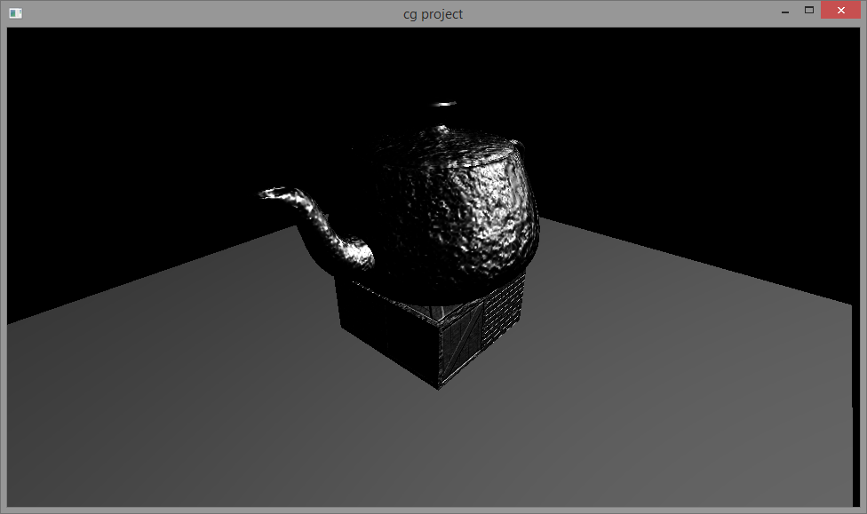
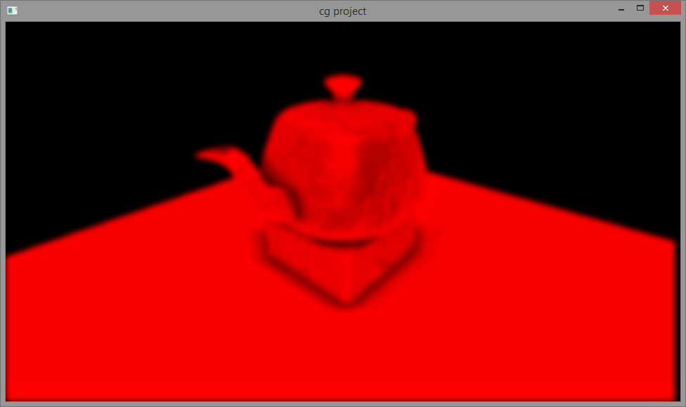
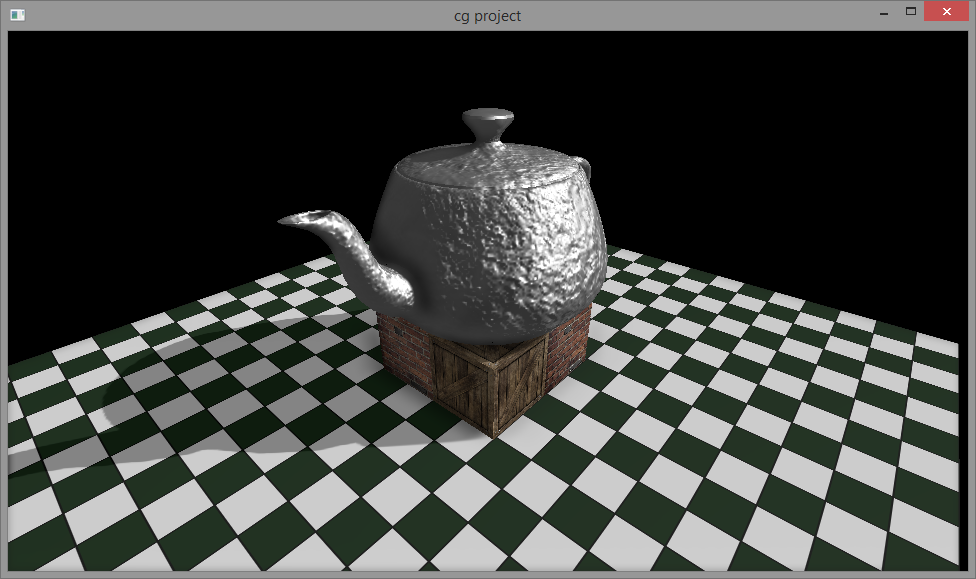

# Deferred lighting renderer
You can rotate camera holding the middle mouse button down. The rotation is similar to Blender.

## Renderer outline
Deferred lighting is divided into three main and three optional passes. You can read more about the deferred lighting approach [here](http://www.realtimerendering.com/blog/deferred-lighting-approaches/).

Deferred lighting renderer uses persistent mapped buffer technique for multi-indirect rendering. Draw indirect buffer uses triple buffering technique to mitigate synchronization with OpenGL command queue. Draw call index buffer is used for gl_DrawID simulation. It is a static buffer object that contains ordered sequence of integers [0, batch_size). The bach_size value is limited by shader's input limitations such as the max number of uniform component and max combined texture units. The final bach_size value equals to 13. To investigate the reason check comments in shader all the files from [data/deferred_lighting_shaders/](../../../data/deferred_lighting_shaders/)

1. GBuffer_pass _(main pass)_.

	The pass fills an rgba32f texture called ```tex_nds```. **rg** components of the texture contain encoded normal (view space). **b** component contains depth (view space). And finally **a** component contains material's smoothness property.
	If the **a** component of a texel equals to 0 then the texel is considered empty. The rest of the passes rely on that assumption. The corresponding test in shaders is written like this:
	```glsl
	if (smoothness <= 0.01) discard;
	```

2. Lighting_pass _(main pass)_.

	The pass fills 3 rgb32f textures that hold ambient,  diffuse & specular lighting terms. The textures are called ```tex_lighting_ambient_term```, ```tex_lighting_diffuse_term``` & ```tex_lighting_specular_term``` respectively.
	
3. Ambient_occlusion_pass _(optional pass)_.

	The pass fills red32f texture called ```tex_ssao_map```. The pass consumes ```tex_nds``` and computes ambient occlusion term for each texel. The ao computation shader implements an algorithm that is similar to the normal oriented hemisphere ssao algorithm. The main difference is that the shader does not bother to calculate orientation matrix for each sample kernel ray and project it into the clip space to get the appropriate texture coordinates. Instead the shader checks dot product of a sample kernel ray and the processed texel's normal and if the dot product is negative then the ray's direction will be reversed. This helps to place that ray and the texel's normal in the same hemisphere. Also each sample kernel ray is reflected about a random normal. This introduces noise in the computation results. After the ao has been calculated the ```tex_ssao_map``` texture is blured by Gaussian filter. While the approach is clearly far from accurate, statistically it work out.
 
4. Shadow_pass _(optional pass)_.
	
	The pass fills rg32f texture called ```tex_shadow_map```. **rg** of the texture components contain depth & squared depth. The squared depth value is required by the variance shadow mapping algorithm. Depth values are in the directional light's space. Also **rg** components are always positive in spite of depth values are negative in the light's space. After the shadow map shader ends the ```tex_shadow_map``` by Gaussian filter.
 
5. Material_lighting_pass _(main pass)_.

	The pass fills an rgb32f texture called ```tex_material_lighting_result```.	The pass combines results of lighting pass, ssao pass & shadow pass with material properties of every object on the scene. Also the pass changes color space of each material's texture from exponential to linear color space. The result of the pass is in high dynamic range and it's in the linear color space. 

6. Tone mapping _(optional pass)_.
	
	The pass consumes the ```tex_material_lighting_result``` texture and fills the back buffer of the default framebuffer.

## Possible improvements

- Uniform array are used heavily in the code. Due to uniform array limitation a decent suggestion is to use uniform block.
- Gbuffer textures like: ```tex_nds```, ```tex_lighting_{ambient/diffuse/specular}_term```, ```tex_ssao_map``` & ```tex_material_lighting_result``` should be organized in one 2d texture array.
- Batch_size might be deduced for each pass separately.

## Screenshots

### The final image.



### Gbuffer_pass ```tex_nds``` texture.



### Lighting_pass

```tex_lighting_ambient_term```


```tex_lighting_diffuse_term```


```tex_lighting_specular_term```


### Shadow_map_pass

There is no screenshot because the texture looks as a window filled with yellow color. This is because the shadow map texture
contains ```std::numeric_limits<float>::max()``` texels where there is no objects on the scene.

### Ssao_pass

The size of ```tex_ssao_map``` is reduced twice to gain some performance advantage.


### Material_lighting_pass

There is no background fill, texture values are in the linear color space & hdr values are just clamped to the range [0, 1].

